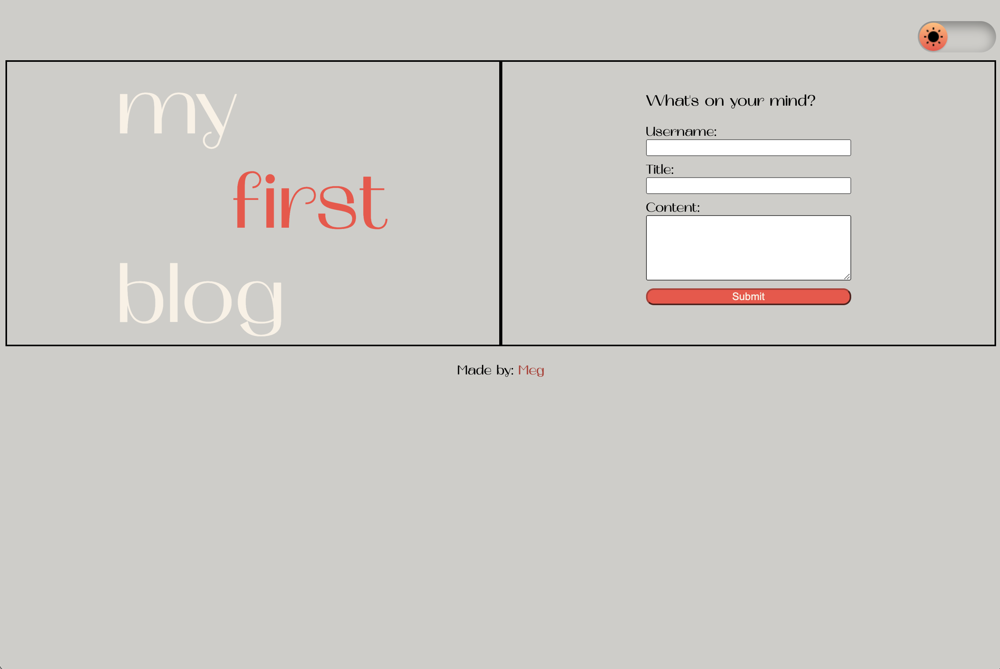
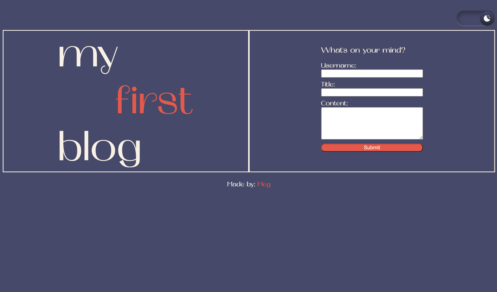
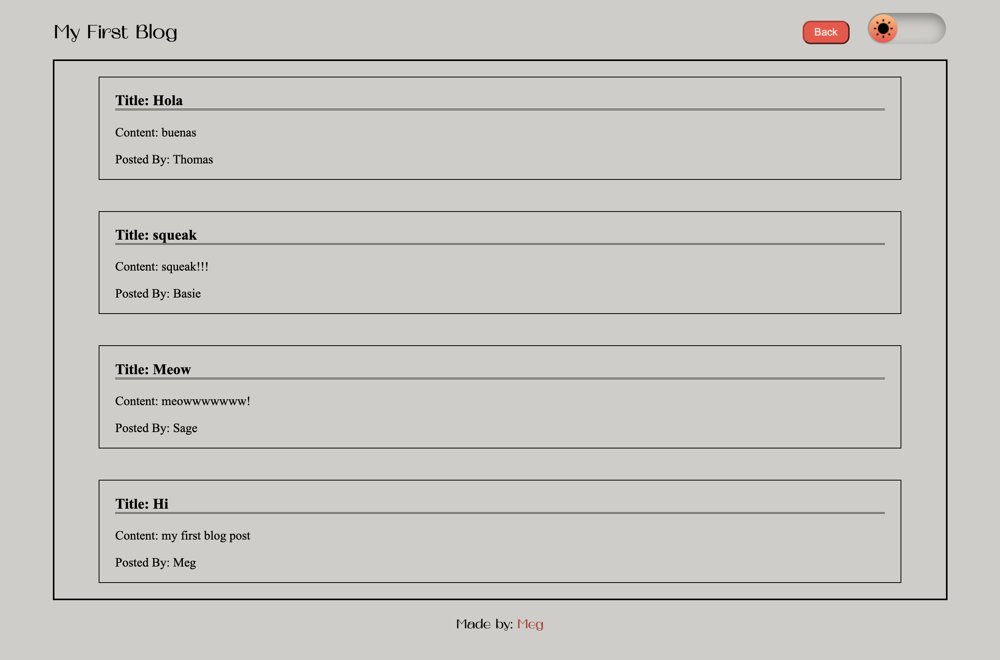

# Blog with Local Storage
Challenge 4 - Personal Blog. This challege contains a personal blog with a username, blog title, and content input that is saved to local storage when submitted. Users are then redirected to a posts page which retrieved the data from local storage and lists all posts that have been stored. This blog also has a light/dark mode toggle that allows users to change the color scheme based on their preference. 

## Screenshots

### Light Mode
 

### Dark Mode
 

### Posts Page
 

## Link 

Portfolio can be located [here](https://mmhilbert.github.io/blog-with-local-storage/)

## License

[MIT](https://choosealicense.com/licenses/mit/)

